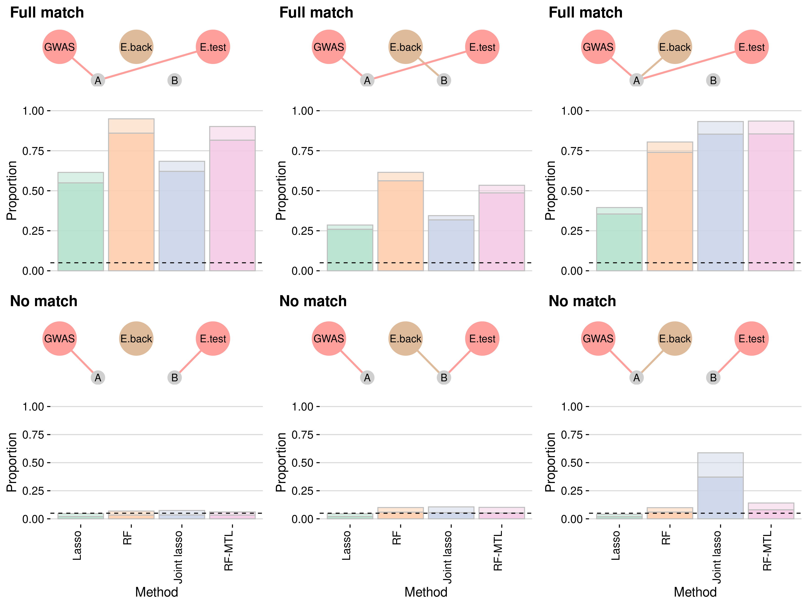
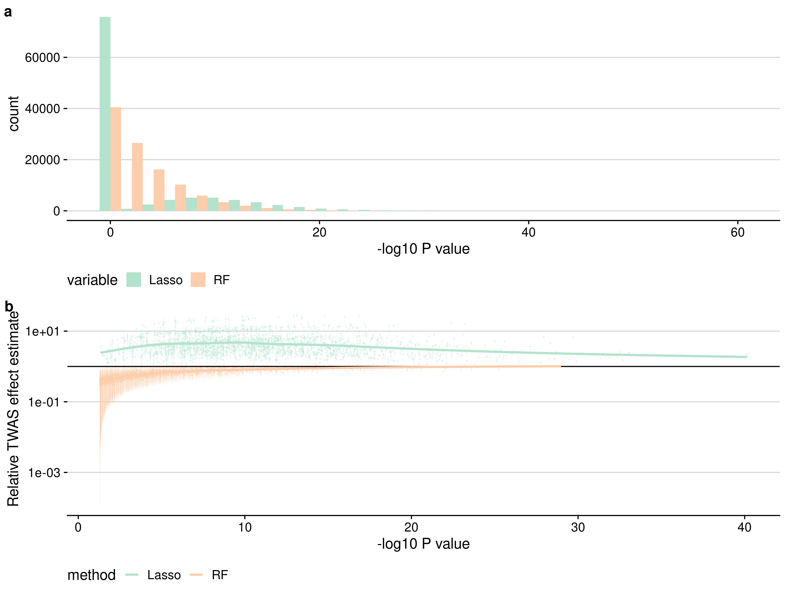

# twas-sims

see [runme-v6.sh](runme-v6.sh) to run.

output:

Power of different methods to detect TWAS association.  In the top row, the GWAS and test eQTL traits share causal variant A, while the causal variant for the background eQTL traits variants (left-right) from none, to B to A.  The bottom row is the same, except the GWAS and eQTL-test causal variants are different.

Effects of lasso shrinkage on TWAS. *a* <!-- Lasso produces constant predictions when there is no effect ("none") as well as in a proportion of simulations where an effect is present.  --> Lasso-TWAS p values amongst simulations with shared eQTL/GWAS causal variants show a spike at p=1, and a longer tail than RF, indicating that weaker effects are missed, but that stronger effects show greater significance. *b* TWAS effect estimates (effect of expression on GWAS trait) are underestimated for weak effects for RF, tending to 1 for stronger effects. For lasso, TWAS effect estimates are systematically over estimated, even for well-powered studies.

